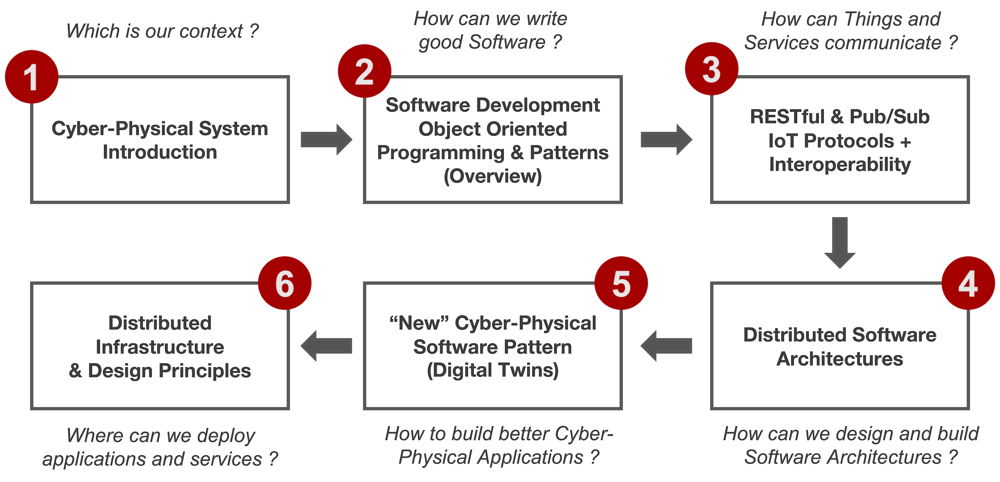

# Distributed and Internet of Things Software Architectures

- **Author**: Marco Picone
- **Affiliation**: University of Modena and Reggio Emilia, Department of Sciences and Methods for Engineering (DISMI)
- **E-Mail**: marco.picone@unimore.it

## Course Overview

The **Distributed and Internet of Things Software Architectures** course aims to equip students with a comprehensive understanding of the challenges and characteristics of Cyber-Physical and Internet of Things (IoT) Distributed Software Systems. This course covers the main principles of distributed architectures and software systems, with a specific focus on communication patterns, design principles, and development techniques.

## Learning Objectives

1. **Understanding Distributed Architectures**: 
   - Study and analyze the core principles of distributed systems, focusing on communication patterns, design principles, and development techniques.   
2. **Interoperability and End-to-End Architectures**:
   - Apply these principles with particular attention to interoperability, and the design and development of end-to-end architectures.
3. **Hands-On Experience with Cutting-Edge Technologies**:
   - Gain practical knowledge through the use of state-of-the-art technologies such as development tools, software libraries, microservice solutions, IoT devices, prototyping boards, computational facilities, and edge/cloud assets in the course laboratories.
4. **Technological and Research Trends**:
   - Explore technological and research trends influencing the field of distributed intelligent cyber-physical and IoT systems, including the design and construction of Digital Twin solutions.
   
## Key Topics

- **Cyber-Physical Systems (CPS)**:
  - Explore the integration of computational algorithms and physical components in CPS.  
- **Software Architectures**:
  - Study various architectural patterns and their applications in distributed systems.
- **Design and Development**:
  - Learn best practices for designing and developing robust and scalable distributed systems.
- **Deployment**:
  - Understand the deployment strategies for distributed systems across different environments.

## Course's Flow

## 🎓 Topics, Lectures & Repositories 

**1. 📚 Introduction to Cyber-Physical Systems and Internet of Things**
  - *📖 Lecture*
    - 📝 [Markdown](https://github.com/Distributed-IoT-Software-Arch-Course/distributed-iot-software-arch-lectures/blob/main/Lectures/1-CPS-Introduction/1_cps_introduction.md) 
    - 📕 [Pdf](https://github.com/Distributed-IoT-Software-Arch-Course/distributed-iot-software-arch-lectures/blob/main/pdf/1_cps_introduction.pdf) 
    - 📘 [ePub](https://github.com/Distributed-IoT-Software-Arch-Course/distributed-iot-software-arch-lectures/blob/main/ePub/1_cps_introduction.epub)

**2. 📚 Python Object Oriented Programming & Use Case Modeling**
   - *📖 Lecture*
     - 📝 [Markdown](https://github.com/Distributed-IoT-Software-Arch-Course/distributed-iot-software-arch-lectures/blob/main/Lectures/2-Python-OOP/2_python_oop.md) 
     - 📕 [Pdf](https://github.com/Distributed-IoT-Software-Arch-Course/distributed-iot-software-arch-lectures/blob/main/pdf/2_python_oop.pdf) 
     - 📘[ePub](https://github.com/Distributed-IoT-Software-Arch-Course/distributed-iot-software-arch-lectures/tree/main/ePub#:~:text=4%20minutes%20ago-,2_python_oop.epub,-Lectures%20metadata%20updated)
   - *🛠️ Source Code*
     - [Python Object Oriented Programming - Playground](https://github.com/Distributed-IoT-Software-Arch-Course/python-oop-playground)
     - [Python Object Oriented Programming - Laboratory](https://github.com/Distributed-IoT-Software-Arch-Course/laboratory-python-oop)

**3. 📚 IoT Protocols Overview**
   - *📖 Lecture* 
     - 📝 [Markdown](https://github.com/Distributed-IoT-Software-Arch-Course/distributed-iot-software-arch-lectures/blob/main/Lectures/3-IoT-Protocols-Overview/3_iot_protocols_overview.md)
     - 📕 [Pdf](https://github.com/Distributed-IoT-Software-Arch-Course/distributed-iot-software-arch-lectures/blob/main/pdf/3_iot_protocols_overview.pdf) 
     - 📘 [ePub](https://github.com/Distributed-IoT-Software-Arch-Course/distributed-iot-software-arch-lectures/blob/main/ePub/3_iot_protocols_overview.epub)
   - *🛠️ Source Code*
     - [Python TCP & UDP - Playground](https://github.com/Distributed-IoT-Software-Arch-Course/python-tcp-udp-playground)

**4. 📚 The HTTP Protocol & RESTful Architectural Style**
   - *📖 Lecture* 
     - 📝 [Markdown](https://github.com/Distributed-IoT-Software-Arch-Course/distributed-iot-software-arch-lectures/blob/main/Lectures/4-HTTP-Protocol-and-REST/4_http_protocol_and_rest.md)
     - 📕 [Pdf](https://github.com/Distributed-IoT-Software-Arch-Course/distributed-iot-software-arch-lectures/blob/main/pdf/4_http_protocol_and_rest.pdf) 
     - 📘 [ePub](https://github.com/Distributed-IoT-Software-Arch-Course/distributed-iot-software-arch-lectures/blob/main/ePub/4_http_protocol_and_rest.epub)
   - *Source Code*
     - [Python HTTP RESTful API - Playground](https://github.com/Distributed-IoT-Software-Arch-Course/python-http-api-playground)
     - [Python HTTP RESTful API - Laboratory](https://github.com/Distributed-IoT-Software-Arch-Course/laboratory-python-http-rest-api)

**5. 📚 The MQTT Protocol**
   - *📖 Lecture*
     - ...
   - *🛠️ Source Code*
     - [Python MQTT - Playground](https://github.com/Distributed-IoT-Software-Arch-Course/python-mqtt-playground)
     - [Python MQTT - Laboratory](https://github.com/Distributed-IoT-Software-Arch-Course/laboratory-python-mqtt)

**6. 📚 Monolithic Software Architectures**
   - *📖 Lecture*
     - ...
   - *🛠️ Source Code*
     - [Python Monolithic Software Architecture - Playground](https://github.com/Distributed-IoT-Software-Arch-Course/iot-monolithic-arch-playground)
     - [Python Monolithic Software Architecture - Laboratory](https://github.com/Distributed-IoT-Software-Arch-Course/iot-monolithic-arch-laboratory)

**7. 📚 Distributed Software Architectures**
   - *📖 Lecture*
     - ...
   - *🛠️ Source Code*
     - [Docker - Playground](https://github.com/Distributed-IoT-Software-Arch-Course/docker-playground)
     - [Docker - Laboratory](https://github.com/Distributed-IoT-Software-Arch-Course/docker-laboratory)
     - [Python Microservices Software Architecture - Playground](https://github.com/Distributed-IoT-Software-Arch-Course/iot-microservice-arch-playground)
     - [Python Microservices Software Architecture - Laboratory](https://github.com/Distributed-IoT-Software-Arch-Course/iot-microservice-arch-laboratory)

## 🎓 Additional Resources 

- [Git Introduction](https://github.com/Distributed-IoT-Software-Arch-Course/.github/blob/main/GitInfo.md)
